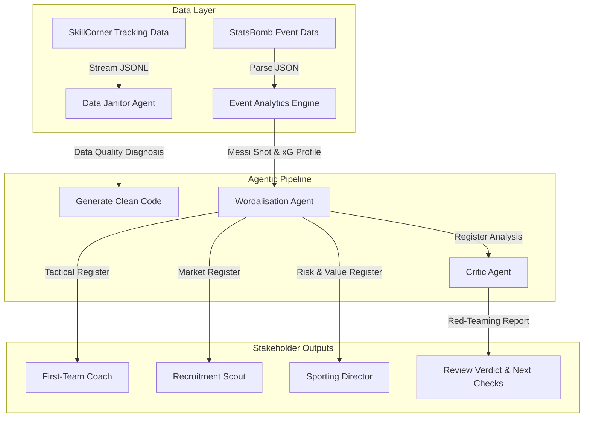

# Agentic Football Analytics System

[](https://www.python.org/downloads/)
[](https://deepmind.google/technologies/gemini/)
[](https://statsbomb.com/what-we-do/hub-free-data/)
[](https://github.com/SkillCorner/opendata)
[](LICENSE)

An agentic football analytics system that combines event and tracking data pipelines with a multi-agent LLM workflow. The system performs automated data quality profiling on broadcast tracking data, computes expected goals (xG) metrics from event data, and utilizes three specialized LLM agents to profile tracking quality, translate quantitative metrics for key club stakeholders, and execute analytical red-teaming (critique) on statistical claims.

---

## 🏗️ Architecture Overview

The system architecture is split into a **Data Pipeline** (handling ingestion and cleaning) and an **Agentic Pipeline** (performing diagnostics, stakeholder translation, and analytical review).



---

## 🎯 Why This Project Exists

Professional football analytics is plagued by two distinct problems:
1. **Dirty Raw Data:** Tracking data (especially broadcast-derived tracking) is structurally messy. Raw files contain coordinate drift, extrapolation artifacts, half-time orientation flips, and missing player tracking frames. Engineers waste hours manually writing cleanup code.
2. **Communication Gaps:** Data scientists speak in expected goals (xG), probability distributions, and non-linear regressions. Technical staffs (Coaches, Scouts, and Directors) make decisions based on tactics, recruitment risk, and squad value. 

This repository demonstrates how to build an **end-to-end engineering system** that automates the profiling/cleaning of raw tracking files and translates complex statistical models into actionable, targeted business intelligence.

---

## 🔑 Key Features

### 1. SkillCorner Broadcast Tracking Data Quality Profiling
Analyzes match tracking data (e.g., Auckland FC vs. Newcastle Jet, Pitch 104x68m) and profiles structural tracking anomalies:
*   **Extrapolated Player Positions:** Separates observed tracking frames (`is_detected=True`) from model-filled, extrapolated positions (`is_detected=False`).
*   **Broadcast Coverage Analysis:** Identifies camera-coverage dropouts where players disappear from the active broadcast frame.
*   **Coordinate Normalization & Half-Time Flips:** Checks and aligns coordinates across halves, fixing directional transitions.
*   **Trajectory Jitter & QA:** Measures position differences frame-by-frame to identify high-frequency jitter.

### 2. StatsBomb Event Analytics & Expected Goals (xG)
Analyzes Lionel Messi's shooting profile using StatsBomb's La Liga 2011/12 open dataset:
*   **Shot Mapping:** Standardizes coordinates to map shot locations.
*   **xG Performance:** Aggregates actual goals scored against StatsBomb's expected goals (xG) model.
*   **Contextual Split Analysis:** Automatically isolates penalty shots from non-penalty shots and direct free-kick contexts to measure true finishing overperformance.

---

## 🤖 AI Agent Pipeline

The project integrates three specialized LLM agents powered by Google Gemini 2.5 Flash, coordinated via custom system prompt structures.

### 1. Data Janitor Agent
*   **Role:** Skeptical Data Engineer.
*   **Responsibilities:** Profiles raw tracking dataframes, diagnoses specific quality anomalies (such as extrapolated position drift or missing columns), explains why these issues corrupt analytics, and generates safe, non-destructive `pandas` preprocessing code.
*   **Guardrails:** Explicitly configured to avoid destructive data dropping that removes valid match phases.

### 2. Wordalisation Agent
*   **Role:** Technical Translator.
*   **Responsibilities:** Transforms a single block of raw numerical data (e.g., Messi's 75 shots, 22 goals, 13.9 xG, 77% inside-box share) into three distinct stakeholder registers:
    
| Stakeholder | Focus | Tone & Style |
| :--- | :--- | :--- |
| **First-Team Coach** | Tactical usage, training drills, shot selection patterns | Actionable, present-tense, football-tactical |
| **Recruitment Scout** | Performance volume, shot quality, sustainability vs. outliers | Analytical, objective, market-focused |
| **Sporting Director** | Portfolio value, financial and squad risk, sample-size limitations | Strategic, risk-aware, executive |

### 3. Critic Agent (Red-Teaming)
*   **Role:** Head of Research & Model-Risk Reviewer.
*   **Responsibilities:** Challenges statistical assertions (e.g., "Messi has elite finishing output") using analytical red-teaming.
*   **Anatomy of a Critique:**
    *   *Deconstructs the headline:* Isolates the contribution of penalties (since penalties inflate overall G-xG metrics).
    *   *Evaluates statistical significance:* Flags whether the sample size (e.g., 12 matches) is large enough.
    *   *Highlights alternative explanations:* Questions model-to-model sensitivity (would another xG model agree?) and flags regression-to-the-mean risks.
    *   *Prescribes validation:* Outputs the top three high-value checks (bootstrapping, uncertainty intervals, peer benchmarking) to verify the claim.

---

## 📂 Folder Structure

```
├── .agents/                    # Workspace configuration files
├── .venv/                      # Python virtual environment
├── main.py                     # Project entry point skeleton
├── messi.ipynb                 # Ingestion, analytics, and agent workflows
├── pyproject.toml              # Project dependencies and packaging settings
├── README.md                   # System documentation
└── .gitignore                  # Git exclude patterns
```

> [vanilla NOTE]
> Heavy raw data folders (`open-data-master/` and `skillcorner/`) containing raw JSON/JSONL datasets are kept locally and are excluded from version control via `.gitignore` to maintain a light, performant repository. The notebook fetches raw data streams directly from public remote sources when running.

---

## 📊 Example Agent Outputs

<details>
<summary><b>📖 View Wordalisation Agent Output (Stakeholder Registers)</b></summary>

```
1) COACH
Messi consistently takes high-quality shots, with 77% of his 75 attempts in this sample coming from inside the penalty box, yielding an average xG of 0.185 per shot. We should reinforce attacking patterns that continue to generate these preferred inside-box shooting locations, leveraging his strong finishing ability. His current output of 1.83 goals per sampled match, significantly overperforming his 13.9 xG, demonstrates the effectiveness of his shot selection and execution.

2) SCOUT
This 12-match sample reveals a player profile with high shot volume (75 shots) and strong chance quality, evidenced by 77% of shots originating from inside the penalty box and an average xG per shot of 0.185. His scoring output is very high, with 22 goals from 13.9 xG, translating to 1.83 goals per sampled match. The +8.1 Goals-minus-xG indicates strong finishing overperformance within this specific sample.

3) SPORTING DIRECTOR
The player's output in this 12-match sample demonstrates exceptional sporting value, with 22 goals scored from 13.9 xG, resulting in a strong +8.1 Goals-minus-xG overperformance and 1.83 goals per sampled match. He consistently generates high-quality opportunities, taking 75 shots with 77% from inside the penalty box. While this production is outstanding, decision-makers should acknowledge these figures are from a limited sample, and the sustainability of this finishing overperformance carries inherent uncertainty.
```
</details>

<details>
<summary><b>📖 View Critic Agent Output (Red-Teaming Report)</b></summary>

```
1) CONCERNS
1. Sample Size and Volatility: The claim is based on a small sample of 12 matches and 75 shots. While the observed +8.1 Goals-minus-xG is substantial, such a positive deviation can be highly volatile over a limited number of events and is susceptible to regression to the mean when extrapolated.
2. Strength of Language: The term "elite-level finishing output" is not supported by the evidence. Without peer benchmarking or multi-season data, it is impossible to definitively classify this performance as "elite" relative to other top players.
3. Penalty Analysis: The claim's total +8.1 Goals-minus-xG is not driven by penalties. In fact, excluding penalties, the non-penalty Goals-minus-xG is even higher at +8.5 (20 goals from 11.5 xG over 72 shots), indicating a strong non-penalty finishing performance within this sample. The 2 goals from 2.4 xG for penalties actually slightly reduced the overall G-xG.
4. Set Piece Inclusion: The non-penalty total includes 13 free-kick shots. These should be separated from open-play shots as free-kicks have lower base xG values but are highly dependent on direct specialization.

2) VERDICT
The claim B) survives only in weaker wording. Within this specific 12-match sample, Lionel Messi demonstrated a robust positive finishing differential of +8.1 Goals-minus-xG from 75 shots, which is even stronger at +8.5 Goals-minus-xG when excluding penalties. This is a significant overperformance relative to the xG model's expectations. However, due to the small sample size and lack of comparative data, it is uncertain whether this output is sustainable outside of this particular sample.

3) NEXT CHECKS
1. Full Season / Multi-Season Non-Penalty G-xG Analysis: Extend the analysis to a full season and multiple seasons, focusing on non-penalty Goals-minus-xG.
2. Peer Benchmarking of Non-Penalty G-xG: Compare Messi's non-penalty Goals-minus-xG against a relevant peer group of top attackers.
3. Uncertainty Interval Calculation for G-xG: Calculate uncertainty intervals (e.g., using bootstrapping or binomial probability) around the observed +8.1 Goals-minus-xG.
```
</details>

---

## 🛠️ Installation

1.  **Clone the Repository:**
    ```bash
    git clone https://github.com/MustafaKocamann/Messi-Analytics-Agent.git
    cd Messi-Analytics-Agent
    ```

2.  **Set Up the Environment:**
    Ensure you are using Python 3.13+. It is recommended to use `uv` for package management:
    ```bash
    # Create virtual environment
    uv venv
    
    # Activate virtual environment
    # On Windows:
    .venv\Scripts\activate
    # On macOS/Linux:
    source .venv/bin/activate
    ```

3.  **Install Dependencies:**
    ```bash
    uv pip install -e .
    ```

4.  **Configure Environment Variables:**
    Create a `.env` file in the root directory:
    ```env
    GOOGLE_API_KEY=your_gemini_api_key_here
    ```

---

## 🚀 Usage

Open the Jupyter notebook to run the analytics engines and LLM agents:

```bash
jupyter notebook messi.ipynb
```

The notebook will execute the following steps:
1. Stream and parse remote SkillCorner tracking datasets.
2. Execute the Data Janitor Agent to evaluate data quality.
3. Ingest StatsBomb La Liga event logs.
4. Run standard event analytics (Messi shot locations, goals vs. xG).
5. Query the Wordalisation Agent for stakeholder outputs.
6. Query the Critic Agent to audit the analytics report.

---

## 🧠 Technical Challenges & Lessons Learned

*   **Handling High-Volume JSONL Data:** Streaming broadcast tracking datasets over HTTP can cause memory exhaustion.
    *   *Solution:* Implemented generator-based streaming via Python's `requests` library to process rows line-by-line without pulling complete multi-gigabyte payloads into local memory.
*   **Git Repository Cleanup:** Committing massive raw tracking and event folders can exceed GitHub's 2GB repository size limit.
    *   *Solution:* Re-initialized the repository history to purge old commit objects, updated `.gitignore` rules, and updated data loaders to stream dataset files directly from open-data CDNs.
*   **LLM Hallucination Guardrails:** Prompt engineering requires absolute boundaries when writing reports for executives.
    *   *Solution:* Implemented strict negative constraint rules (e.g., "Do not invent contract demands", "Do not claim an xG model has features not present in the evidence block") to keep the output grounded in evidence.

---

## 🔮 Future Work / Roadmap

*   [ ] **Uncertainty Simulations:** Add Monte Carlo simulation checks to compute probability distributions for Messi's shot conversion over the 12-match sample.
*   [ ] **Peer Benchmarking:** Integrate comparative dataset loaders to evaluate Messi's non-penalty G-xG against other La Liga forwards.
*   [ ] **Automated Code Execution:** Integrate a Python REPL sandbox tool allowing the Data Janitor Agent to test and verify its generated cleaning scripts locally before exporting them.

---

## 🛠️ Tech Stack

*   **Core:** Python 3.13
*   **Data Science & Ingestion:** Pandas, NumPy, Requests
*   **Visualization:** Matplotlib, mplsoccer
*   **AI Agent Orchestration:** Google Gemini 2.5 Flash, LangChain, LangChain-Google-GenAI
*   **Open Football Datasets:** StatsBomb Open Data, SkillCorner Open Data

---

## 🤝 Contributing

Contributions to the codebase are welcome. Please ensure that:
1. Analytical methods remain mathematically grounded.
2. Agent prompt templates preserve grounding guidelines.
3. Large raw datasets are not added to commits.

---

## 📄 License

Distributed under the MIT License. See [LICENSE](LICENSE) for more information.
